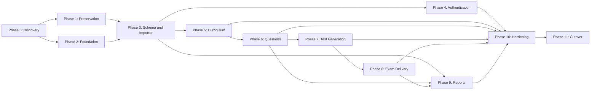

# Aircraft Systems Tester Modernization Plan

**Status:** Approved for implementation planning  
**Last updated:** July 12, 2026
**Legacy application:** SJTester / Aircraft Systems Tester  
**Target stack:** SvelteKit, TypeScript, Node.js, and SQLite

## 1. Purpose

This document defines the complete plan for replacing the legacy jQuery, PHP,
and MySQL application with a maintainable SvelteKit and SQLite application. It
is intended to guide discovery, implementation, data migration, verification,
deployment, and final retirement of the legacy system.

The migration is a behavioral and data-preservation project, not a mechanical
translation of PHP pages into Svelte components. The new system should preserve
valid workflows and historical records while correcting security, integrity,
concurrency, accessibility, and maintainability problems found in the legacy
implementation.

## 2. Goals

The project will:

- Replace the jQuery/PHP frontend and server code with a TypeScript SvelteKit
  application.
- Replace MySQL with a normalized SQLite database suitable for the current
  workload.
- Preserve the authoritative curriculum, question bank, generated exams,
  student attempts, scores, and reportable history.
- Preserve all business behavior confirmed as intentional by a subject-matter
  expert.
- Provide secure instructor authentication and role-based authorization.
- Make exam generation and grading transactional, auditable, and testable.
- Replace page-specific AJAX endpoints with cohesive server-side domain
  services and typed application boundaries.
- Establish automated tests, schema migrations, backups, observability, and a
  repeatable release process.
- Retire the legacy application after a verified cutover and retention period.

## 3. Non-goals

Unless separately approved, the initial migration will not:

- Add new instructional or grading policy.
- Redesign the curriculum hierarchy beyond what is needed to represent the
  authoritative production data.
- Introduce real-time collaborative editing.
- Add native mobile applications.
- Add horizontal application scaling while SQLite remains the database.
- Copy known legacy defects merely to obtain exact implementation parity.
- Import every abandoned prototype or duplicate page as a supported feature.

## 4. Legacy system assessment

### 4.1 Functional domains

Repository inspection identified the following domains:

1. **Instructor identity and administration**
   - Instructor login and logout
   - Instructor profile management
   - Administrator role and instructor management

2. **Aircraft and curriculum metadata**
   - ERJ and CRJ variants
   - Historical TPO, SPO, and EO taxonomy
   - Newer Phase, Task, Subtask, and Element hierarchy
   - Bloom taxonomy levels and key verbs

3. **Question bank**
   - Question creation, editing, viewing, and deletion
   - Aircraft-variant assignment
   - Curriculum assignment
   - Primary and alternate wording
   - Correct and incorrect answer choices
   - Multiple choice, true/false, all-correct, none-correct, and
     multiple-correct question behavior

4. **Test models and generation**
   - Test-template creation and deletion
   - Question quantities by curriculum category
   - Mandatory learning elements
   - Daily quiz and predefined test-type generation
   - Random question and answer-choice selection
   - Generated test passwords and override passwords

5. **Exam delivery and grading**
   - Student and exam access data
   - Exam navigation
   - Answer selection
   - Marked and unanswered question review
   - Submission and grading
   - Retraining and satisfactory/unsatisfactory outcomes

6. **Reporting and export**
   - Instructor test history
   - Class and student scores
   - Missed-question analysis
   - Curriculum/SPO analysis
   - Instructor administration reports
   - CSV exports and printable test views

### 4.2 Likely active entry points

The active application appears to center on:

- `instructorArea.php`
- `examCMS.php`
- `questionCRUD_taskModeling.php`
- `testModeling_taskModeling.php`
- `taskModeling.php`
- `faq.php`
- `PHPScripts/`
- `Classes/`

Older or competing implementations include `questionCRUD.php`,
`testModeling.php`, `testCRUD.php`, `aerodataCRUD.php`, and
`instructorArea_wip.php`. Their production status must be confirmed during
discovery. They must not automatically become migration requirements merely
because they exist in the repository.

### 4.3 Known technical risks

- The PHP application uses the removed `mysql_*` API.
- SQL is frequently assembled by string concatenation.
- Instructor passwords are compared as plaintext.
- Database credentials have been committed to source history.
- Historical dumps contain personal information, answer keys, and test data.
- The MySQL tables use MyISAM and do not enforce foreign keys.
- Several operations span multiple writes without transactions.
- Generated test IDs are retrieved using the most recent timestamp, creating a
  race between simultaneous test generations.
- Some endpoints contain hard-coded instructor or aircraft values.
- Some update-query paths appear malformed or incomplete.
- Authorization is largely coupled to PHP session variables and page behavior.
- UI state and business rules are embedded together in large PHP pages.
- There are duplicate and work-in-progress implementations of major features.
- Current code and checked-in database dumps do not describe the same schema.

### 4.4 Critical schema-drift finding

The newest checked-in production dump is from 2014. It contains the older
TPO/SPO/EO hierarchy and a 15-column `questions` table. The current task-modeling
branch expects Phase/Task/Subtask/Element/Bloom tables and writes additional
question associations.

Therefore:

- The live production database is the only acceptable source of truth.
- Checked-in SQL dumps are archaeological references, not production migration
  inputs unless the owner explicitly confirms otherwise.
- No final target schema or importer may be approved before the live schema,
  row counts, and representative records have been inspected.
- The relationship between TPO/SPO/EO and Phase/Task/Subtask/Element must be
  resolved explicitly rather than guessed.

## 5. Migration principles

1. **Preserve behavior before replacing it.** Capture the intended workflow and
   representative results before implementing each domain.
2. **Use production data as evidence.** Source code, documentation, database
   contents, and user testimony must be reconciled.
3. **Keep business logic out of UI components.** Test generation, grading, and
   reporting calculations belong in server-side domain modules.
4. **Protect historical meaning.** Editing a question must not rewrite a
   previously generated exam or its grading record.
5. **Prefer explicit constraints.** Use foreign keys, unique constraints,
   checks, and transactions instead of relying on application convention.
6. **Make migrations repeatable.** A clean environment must be buildable from
   version-controlled schema migrations and an idempotent data importer.
7. **Treat security remediation as part of the migration.** Unsafe passwords,
   secrets, and authorization behavior will not be preserved.
8. **Cut over once, after rehearsal.** Avoid long-lived dual writes between
   MySQL and SQLite.

## 6. Target architecture

### 6.1 Application stack

| Concern | Selected approach |
| --- | --- |
| Web framework | SvelteKit with TypeScript |
| Rendering | Server-rendered pages with progressive enhancement |
| Server runtime | Supported Node.js LTS release |
| Deployment adapter | `@sveltejs/adapter-node` |
| Database | SQLite on persistent local storage |
| Data access | Drizzle ORM and version-controlled SQL migrations |
| Input validation | Shared TypeScript validation schemas, initially Zod |
| Authentication | Revocable database-backed sessions |
| Password hashing | Argon2id through a maintained Node implementation |
| Unit/integration tests | Vitest |
| Browser tests | Playwright |
| Code quality | TypeScript strict mode, ESLint, and Prettier |
| Packaging | Reproducible Node build, optionally containerized |

SvelteKit will provide both UI and backend behavior. A separate Express API is
not required. Server form actions should serve ordinary CRUD forms, while
`+server.ts` endpoints should be reserved for interfaces that genuinely need a
JSON contract, such as exam autosave or export downloads.

### 6.2 Proposed source structure

```text
src/
  lib/
    components/
    schemas/
    server/
      auth/
      db/
      curriculum/
      questions/
      test-models/
      exams/
      reports/
      audit/
  routes/
    login/
    exam/
    staff/
      dashboard/
      curriculum/
      questions/
      test-models/
      generated-tests/
      reports/
      instructors/
  hooks.server.ts
drizzle/
scripts/
  migration/
tests/
  unit/
  integration/
  migration/
  e2e/
```

### 6.3 Request and authorization flow

1. The request enters SvelteKit through a server hook.
2. The hook reads the secure session cookie and resolves the current user.
3. User and role information is placed in server locals.
4. Route guards enforce public, instructor, or administrator access.
5. Server loads and actions call domain services.
6. Domain services validate business rules and use repositories for database
   access.
7. All multi-record mutations use explicit transactions.
8. Security-sensitive changes generate an audit event.

Client-side visibility is never an authorization boundary.

### 6.4 SQLite operating model

SQLite is appropriate for the observed dataset and expected classroom workload,
provided the application is deployed as one writable Node instance with local,
persistent storage.

Every application connection must configure and verify:

- `PRAGMA foreign_keys = ON`
- `PRAGMA journal_mode = WAL`
- `PRAGMA busy_timeout = <approved milliseconds>`
- An appropriate `PRAGMA synchronous` setting based on the durability review

Operational constraints:

- Do not place the live SQLite file on a general network filesystem.
- Do not run multiple independent writable application hosts against one file.
- Keep write transactions short.
- Use the SQLite online backup mechanism or a driver-supported equivalent.
- Copy encrypted backups to storage outside the application host.
- Run scheduled integrity checks and test restoration regularly.
- If future write concurrency or multi-region operation exceeds SQLite's model,
  migrate the data layer to PostgreSQL without rewriting domain behavior.

## 7. Proposed data model

Names may change after live-schema discovery, but the following logical model is
the implementation baseline.

### 7.1 Identity and audit

#### `users`

- `id`
- `legacy_instructor_id`
- `employee_number` (text, unique)
- `first_name`
- `last_name`
- `password_hash`
- `role` (`instructor` or `admin`)
- `active`
- `created_at`
- `updated_at`
- `password_changed_at`

#### `sessions`

- `id` or hashed session token
- `user_id`
- `expires_at`
- `created_at`
- Optional client metadata needed for security review

#### `audit_events`

- `id`
- `actor_user_id`
- `action`
- `entity_type`
- `entity_id`
- `before_json`
- `after_json`
- `created_at`

### 7.2 Aircraft and curriculum

#### `aircraft_variants`

- `id`
- `legacy_id`
- `code`
- `name`
- `active`

#### `phases`

- `id`
- `legacy_id`
- `position`
- `name`
- `bloom_verb_id`

#### `tasks`

- `id`
- `legacy_id`
- `phase_id`
- `position`
- `name`
- `description`
- `bloom_verb_id`

#### `subtasks`

- `id`
- `legacy_id`
- `task_id`
- `position`
- `name`
- `description`
- `bloom_verb_id`

#### `elements`

- `id`
- `legacy_id`
- `subtask_id`
- `position`
- `name`
- `description`

#### `bloom_levels` and `bloom_verbs`

Bloom ordinality and display names should be separate from individual verbs so
the hierarchy can reference a stable verb record.

The live-data audit will determine whether TPO/SPO/EO entities remain canonical,
map into this hierarchy, or must be retained as a separate legacy curriculum.

### 7.3 Question bank

#### `questions`

- `id`
- `legacy_id`
- `aircraft_variant_id`
- `subtask_id`
- `element_id`
- `question_type`
- `status` (`draft`, `active`, or `archived`)
- `created_by`
- `updated_by`
- `created_at`
- `updated_at`

#### `question_prompts`

- `id`
- `question_id`
- `text`
- `position`

This represents primary and alternate question wording without fixed columns.

#### `question_options`

- `id`
- `question_id`
- `text`
- `is_correct`
- `position`

This represents all legacy question types without fixed `a`, `b`, `c`, `d`,
`correct_answer`, or `ans_x` columns. Type-specific validation will enforce the
permitted number of correct and incorrect choices.

Questions referenced by historical exams should be archived instead of hard
deleted.

### 7.4 Test templates and generated exams

#### `test_templates`

- `id`
- `legacy_id`
- `name`
- `aircraft_variant_id`
- `course_type`
- `length`
- `active`
- Audit timestamps and users

#### `test_template_rules`

- `id`
- `test_template_id`
- `subtask_id`
- `question_count`

#### `test_template_required_elements`

- `test_template_id`
- `element_id`

#### `exam_instances`

- `id`
- `legacy_id`
- `test_template_id`
- `aircraft_variant_id`
- `course_type`
- `instructor_user_id`
- `access_code_hash`
- `override_code_hash`
- `created_at`
- `opens_at`
- `closes_at`
- `status`
- Optional generation seed or audit metadata

#### `exam_questions`

- `id`
- `exam_instance_id`
- `source_question_id`
- `position`
- `question_type`
- `prompt_text`

#### `exam_question_options`

- `id`
- `exam_question_id`
- `source_option_id`
- `position`
- `option_text`
- `is_correct`

The generated-exam tables are immutable snapshots. They preserve what a student
actually saw and how it was graded even if the source question later changes.

### 7.5 Attempts and answers

#### `exam_attempts`

- `id`
- `legacy_record_id`
- `exam_instance_id`
- `employee_number`
- `first_name`
- `last_name`
- `class_date`
- `syllabus`
- `qualification_code`
- `retrain`
- `started_at`
- `submitted_at`
- `status`
- `score_percent`
- `outcome`

#### `attempt_answers`

- `id`
- `exam_attempt_id`
- `exam_question_id`
- `selected_option_id`
- `is_correct`
- `answered_at`

Unique constraints must prevent duplicate attempts or duplicate answers where
the business rules do not permit them. Submission and grading must be
idempotent.

## 8. Business-rule modernization

### 8.1 Test generation

The new generator must:

- Validate that each template rule can be satisfied before creating an exam.
- Select mandatory-element questions first.
- Prevent duplicate question selection.
- Fill remaining category quantities from eligible active questions.
- Apply aircraft-variant constraints.
- Snapshot the chosen prompt and randomized options.
- Perform the complete generation inside one transaction.
- Return a domain error without a partial exam if inventory is insufficient.
- Record enough metadata to reproduce or audit selection when needed.

The old `ORDER BY RAND()` implementation should not be copied. Random selection
should be explicit and testable.

### 8.2 Exam access

- Access and override codes must be generated with a cryptographically secure
  random source.
- Only hashes of codes should be retained after the one-time display or approved
  printable handoff.
- Login attempts should be rate-limited.
- Access rules must define opening, closing, reuse, override, and attempt-count
  behavior.
- Student answers must never be sent with correctness metadata before submission.

### 8.3 Grading

- Grading occurs only on the server against the immutable exam snapshot.
- Submission and result creation occur in one transaction.
- Repeated submission requests return the existing result.
- Pass/fail thresholds and rounding rules must be documented and tested.
- Administrative corrections must be auditable and must not silently overwrite
  original values.

### 8.4 Deletion

- Curriculum nodes with dependent questions or templates cannot be silently
  deleted.
- Questions used historically are archived.
- Generated exams and student attempts are retained according to the approved
  retention policy.
- Hard deletion is limited to safe draft data or an explicit administrative
  maintenance workflow.

## 9. Implementation phases

### 9.1 Parallelization model

The numbered phases describe delivery gates, not a requirement that all work be
performed serially. Work may proceed in parallel when the upstream contracts it
uses are stable and each tranche has a clear owner. A phase is complete only
when all of its tranches have converged and its acceptance gate has passed.



The primary critical path is:

`Phase 0 → Phase 1 → Phase 3 → Phase 5 → Phase 6 → Phase 7 → Phase 8 → Phase 10 → Phase 11`

Phase 2 can overlap much of Phase 1. Phase 4 can run beside Phase 5. Phase 9 can
begin once the historical target schema and golden reports are stable, but it
cannot finish until question and attempt semantics are final.

Cross-phase overlap rules:

- Repository-only discovery and legacy behavior capture may begin together,
  but the final Phase 1 fixture and characterization baseline depend on Phase 0
  decisions.
- Framework, CI, design-system, and deployment scaffolding may proceed while
  preservation work is underway.
- Draft schema and importer prototypes may start during Phase 2, but the initial
  production schema migration must have one owner and cannot be finalized
  before Phase 0 and Phase 1 evidence is accepted.
- Authentication and curriculum implementation may proceed in parallel after
  the shared user, audit, and curriculum schemas are stable.
- UI work may use typed fixture repositories while its domain service or
  importer is being implemented, provided the contract is versioned and owned.
- Formal security, accessibility, performance, backup, and observability work
  occurs in Phase 10, but their automated checks and design constraints begin
  in Phase 2 and continue in every feature phase.
- Production cutover preparation has parallel activities, but the actual data
  freeze, final import, reconciliation, opening, and authority switch form one
  controlled sequential runbook.

### 9.2 Coordination rules for parallel tranches

- Assign one integration owner for the target schema and migration sequence.
- Assign one owner for each shared domain contract; consumers propose changes
  through that owner rather than changing it independently.
- Keep tranches in short-lived branches and integrate continuously behind tests
  or disabled routes.
- Avoid dividing work by frontend versus backend for an entire phase. Prefer
  vertical ownership of a coherent feature, with shared UI and data primitives
  agreed first.
- Use sanitized fixtures and contract tests so UI, importer, and domain work can
  proceed without sharing production data.
- Treat database migrations as an ordered queue. Parallel feature branches may
  define draft migrations, but the schema owner rebases and sequences them
  before integration.
- Hold a convergence review at each phase gate to resolve contract drift,
  combine test evidence, and update the next phase's dependencies.

### Phase 0: Live-system discovery and scope confirmation

**Estimated effort:** 1–2 engineer-weeks

Parallel tranches:

- **0A — Database discovery:** acquire the live schema, profile tables and row
  counts, inspect encodings, and identify relationship anomalies.
- **0B — Workflow archaeology:** inventory active URLs, PHP endpoints, reports,
  duplicate pages, and observable user flows.
- **0C — Business-rule interviews:** confirm question types, test-generation,
  grading, access, override, resume, and retention rules.
- **0D — Operations and security discovery:** document hosting, concurrency,
  backups, secrets, data classification, and production access controls.

These tranches can run concurrently. They converge on the authoritative feature
inventory, hierarchy decision, and signed-off migration scope.

Deliverables:

- Authoritative production database schema export
- Table and row-count inventory
- Active URL and workflow inventory
- Duplicate-page disposition list
- Data classification and retention requirements
- TPO/SPO/EO versus task hierarchy decision
- Question-type rules and scoring rules
- Current hosting and concurrency profile
- Signed-off migration scope

Acceptance gate:

- Every production table and active workflow has an owner and disposition.
- Schema drift is understood.
- There are no unresolved questions that would materially change the target
  schema.

### Phase 1: Preservation and characterization

**Estimated effort:** 1–2 engineer-weeks

Parallel tranches:

- **1A — Data fixture:** create and validate the sanitized representative MySQL
  fixture.
- **1B — UI and API capture:** record active workflows, screenshots, request and
  response examples, validation behavior, and failure states.
- **1C — Business-logic characterization:** build golden cases for question
  behavior, generation, grading, and report totals.
- **1D — Data-handling controls:** establish storage, access, sanitization, and
  destruction procedures for sensitive exports.

Tranches 1B and 1C can begin from repository evidence while Phase 0 is still
finishing. Tranche 1A requires access and classification decisions from Phase 0.
All four converge on one approved preservation baseline.

Deliverables:

- Sanitized representative MySQL fixture
- Screenshots or recordings of active workflows
- Legacy request/response examples
- Golden examples of generated exams and reports
- Characterization tests for high-risk business rules
- Sensitive-data handling procedure

Acceptance gate:

- The team can demonstrate current behavior without using production personal
  data in ordinary development.

### Phase 2: SvelteKit and SQLite foundation

**Estimated effort:** 1–2 engineer-weeks

Parallel tranches:

- **2A — Application scaffold:** SvelteKit, TypeScript strict mode, package
  management, route shell, and production build.
- **2B — Data foundation:** SQLite driver evaluation, connection configuration,
  Drizzle migration harness, transaction helpers, and ephemeral test database.
- **2C — UI foundation:** navigation, form primitives, error presentation,
  responsive layout, and accessibility conventions.
- **2D — Delivery foundation:** CI, configuration validation, structured
  logging, health/readiness checks, and deployment artifact.

All four can run concurrently after agreeing on repository structure, runtime
version, coding conventions, and the minimal database interface. This phase can
overlap most of Phase 1.

Deliverables:

- SvelteKit TypeScript project
- Adapter-node production build
- Drizzle schema and migration workflow
- SQLite connection configuration
- Application layout and navigation shell
- Error pages, structured logging, health endpoint, and configuration validation
- CI checks for formatting, linting, types, tests, and production build
- Local developer setup documentation

Acceptance gate:

- A clean checkout can create the database, run tests, build, and start the
  application using documented commands.

### Phase 3: Target schema and data importer

**Estimated effort:** 2–3 engineer-weeks

Parallel tranches:

- **3A — Canonical schema:** finalize entities, constraints, delete behavior,
  indexes, and ordered Drizzle migrations.
- **3B — Extraction and transformation:** parse/export MySQL records, normalize
  encodings and identifiers, transform entities, and maintain legacy ID maps.
- **3C — Anomaly and reconciliation tooling:** detect rejects and orphans,
  calculate source/target counts and aggregates, and produce reviewable reports.
- **3D — Migration test harness:** automate clean imports, repeatability checks,
  integrity checks, representative query performance, and fixture publication.

Tranches 3B–3D may work against a versioned draft schema, but tranche 3A owns
schema changes and migration ordering. The phase converges on a stable,
reconciled SQLite fixture that later domain work treats as authoritative.

Deliverables:

- Approved normalized schema
- Version-controlled initial migrations
- Idempotent MySQL-to-SQLite importer
- Source-to-target ID mapping tables or reports
- Reject and anomaly reports
- Automated reconciliation report
- Staging database built from a current production export

Acceptance gate:

- Repeated imports produce identical target data.
- Expected counts, relationships, exams, attempts, scores, and report aggregates
  reconcile.
- `foreign_key_check` and `integrity_check` pass.

### Phase 4: Authentication and instructor administration

**Estimated effort:** 1–2 engineer-weeks

Parallel tranches:

- **4A — Authentication core:** password hashing, login/logout, session storage,
  expiry, revocation, and secure cookies.
- **4B — Authorization:** route guards, instructor/admin policies, and server
  action enforcement.
- **4C — Instructor administration:** list, add, edit, activate/deactivate, and
  role-management services and UI.
- **4D — Security and audit verification:** rate limits, audit events, password
  migration/reset flow, and authorization integration tests.

Tranches 4A and 4C can begin together after the user schema is stable; 4B uses
the session contract from 4A, while 4D starts with test design and converges
after the other tranches. Phase 4 can run beside Phase 5.

Deliverables:

- Login/logout and revocable sessions
- Instructor and administrator route guards
- Password hashing and forced reset/migration policy
- Instructor list, add, edit, activate/deactivate, and role management
- Audit events for administrative changes
- Authentication rate limiting and secure-cookie configuration

Acceptance gate:

- Authorization integration tests cover every protected route and mutation.
- Plaintext legacy passwords are not present in SQLite.

### Phase 5: Curriculum modeling

**Estimated effort:** 2 engineer-weeks

Parallel tranches:

- **5A — Curriculum domain:** repositories, services, validation, ordering,
  dependency checks, and transactional mutations.
- **5B — Curriculum UI:** hierarchy view, editors, reorder interaction, and
  dependency warnings built against typed fixtures or stable service contracts.
- **5C — Curriculum migration:** TPO/SPO/EO mapping where required, task-model
  import validation, and curriculum reconciliation.
- **5D — Verification:** characterization cases, database constraints,
  accessibility, keyboard operation, and end-to-end CRUD tests.

Tranches 5A–5C can run concurrently after Phase 3 freezes curriculum contracts.
Tranche 5D begins with fixtures and finishes after integration. Phase 5 can run
beside Phase 4.

Deliverables:

- Phase, Task, Subtask, and Element views
- Create, edit, reorder, archive/delete behavior
- Bloom level and verb selection
- Referential dependency warnings
- Responsive and keyboard-accessible hierarchy UI

Acceptance gate:

- The legacy task-modeling test cases are implemented as automated tests.
- Ordering and dependency constraints are enforced by both service and database.

### Phase 6: Question bank

**Estimated effort:** 2–3 engineer-weeks

Parallel tranches:

- **6A — Question domain:** question-type validation, prompt/option services,
  archive behavior, filtering, and search queries.
- **6B — Authoring UI:** list/search, create/edit forms, previews, aircraft and
  curriculum selectors, and accessible error handling.
- **6C — Question migration:** transform fixed legacy columns, resolve mappings,
  classify anomalies, and reconcile by type, aircraft, and curriculum.
- **6D — Verification:** golden question fixtures, contract tests, integration
  tests, and browser coverage for every approved question type.

Tranches 6A–6C can run concurrently after Phase 5 stabilizes curriculum IDs and
delete semantics. Tranche 6B may start earlier against fixtures, but it must not
invent curriculum or question-type rules.

Deliverables:

- Question list, filtering, and search
- Create/edit/archive workflows
- All approved question types
- Alternate prompts and flexible answer options
- Aircraft and curriculum tagging
- Validation and question-preview UI

Acceptance gate:

- Migrated question counts reconcile by aircraft, curriculum node, type, and
  status.
- Golden question fixtures render and validate correctly.

### Phase 7: Test modeling and generation

**Estimated effort:** 2–3 engineer-weeks

Parallel tranches:

- **7A — Template management:** template rules, mandatory elements, capacity
  queries, CRUD services, and editor UI.
- **7B — Selection engine:** pure, deterministic/testable question selection,
  duplicate prevention, mandatory-first behavior, and inventory errors.
- **7C — Exam snapshot transaction:** generated exam persistence, prompt/option
  snapshots, secure access codes, audit metadata, and rollback behavior.
- **7D — Generated-test experience and verification:** detail/print views,
  golden generation tests, property tests, and concurrency integration tests.

Tranches 7A and 7B can begin together once the question service contract is
stable. Tranche 7C can begin from the approved snapshot schema, then integrates
the selection engine. Tranche 7D proceeds throughout and closes the phase gate.

Deliverables:

- Test-template list and editor
- Category quantities and mandatory elements
- Inventory/capacity feedback
- Transactional exam generator
- Secure access-code creation
- Generated-test detail and printable view

Acceptance gate:

- Unit tests cover generation success, insufficient inventory, mandatory
  selection, duplicate prevention, randomness boundaries, and rollback.

### Phase 8: Exam delivery and grading

**Estimated effort:** 2–3 engineer-weeks

Parallel tranches:

- **8A — Attempt lifecycle:** exam access, student metadata, attempt creation,
  expiry/resume rules, autosave endpoints, and server-side state transitions.
- **8B — Exam runner UI:** question navigation, answer selection, marked and
  unanswered views, review, interruption recovery, and completion UI.
- **8C — Grading engine:** immutable-snapshot evaluation, rounding, outcome,
  idempotent submission, and administrative-correction rules.
- **8D — Security and reliability verification:** payload inspection, rate
  limits, concurrent students, duplicate submissions, interruption tests, and
  complete Playwright journeys.

Tranches 8A and 8C can begin together after the exam snapshot and business-rule
contracts are stable. Tranche 8B works against the attempt API contract. Tranche
8D begins with threat cases and converges after full integration.

Deliverables:

- Student access form
- Student/class metadata form
- Question navigation and answer persistence
- Marked, unanswered, and review views
- Safe resume behavior, if confirmed as a requirement
- Idempotent submission and server-side grading
- Completion and outcome view

Acceptance gate:

- Playwright covers a complete exam, interruption, validation errors, duplicate
  submission, and concurrent students.
- Correct answers cannot be obtained from pre-submission client payloads.

### Phase 9: Reports and exports

**Estimated effort:** 2 engineer-weeks

Parallel tranches:

- **9A — Reporting services:** historical test, class, student, missed-question,
  and curriculum aggregates.
- **9B — Report experiences:** report selection, tables, drill-down views,
  printable layouts, and CSV exports.
- **9C — Parity and performance:** golden-report comparison, intentional-delta
  documentation, query plans, indexes, and large-range tests.

Report families within 9A may be divided among owners after shared filter,
authorization, date, and aggregation conventions are fixed. Tranches 9A and 9C
can begin after Phase 3 provides reconciled historical data; attempt-dependent
reports converge only after Phase 8 finalizes attempt semantics. Tranche 9B can
proceed against typed report fixtures.

Deliverables:

- Instructor test history
- Class and individual student reports
- Missed-question and curriculum analysis
- Administrator score views
- CSV exports
- Printable test/report views

Acceptance gate:

- Golden legacy and new reports match for approved fixture data, or every
  intentional difference is documented and accepted.

### Phase 10: Hardening and release readiness

**Estimated effort:** 1–2 engineer-weeks

Parallel tranches:

- **10A — Security:** threat review, dependency review, authorization audit,
  secret handling, headers, cookies, CSRF, and remediation verification.
- **10B — Accessibility and UX:** automated and manual accessibility review,
  keyboard testing, responsive checks, and recovery/error usability.
- **10C — Performance and concurrency:** representative load, SQLite contention,
  report performance, resource limits, and graceful shutdown.
- **10D — Operations:** backup automation, restoration drill, monitoring,
  alerts, runbooks, and release artifact validation.
- **10E — Acceptance and rehearsal:** user acceptance testing, migration/cutover
  rehearsal, defect triage, and release checklist ownership.

Audits can run concurrently, but fixes that affect shared contracts must be
integrated through their domain owners. Tranche 10E is the convergence point and
cannot approve release until all other tranches provide evidence.

Deliverables:

- Security review and remediation
- Accessibility review
- Performance and concurrency tests
- Backup automation and successful restoration drill
- Monitoring, alerting, and operational runbook
- User acceptance testing
- Cutover and rollback rehearsal

Acceptance gate:

- Release checklist is approved by the application owner and operator.

### Phase 11: Production cutover and retirement

**Estimated effort:** 3–5 focused days plus stabilization monitoring

Parallel tranches:

- **11A — Data readiness:** verify exports, importer artifact, reconciliation
  thresholds, backup destinations, and rollback data procedure.
- **11B — Platform readiness:** deploy the release artifact, configure secrets,
  routing, TLS/proxy behavior, monitoring, and persistent storage.
- **11C — People and validation readiness:** maintenance communication, smoke
  test assignments, owner approvals, support coverage, and issue triage.
- **11D — Stabilization:** monitoring, incident response, reconciliation of any
  approved corrections, and legacy retirement evidence.

Preparation tranches 11A–11C run concurrently before the window. During the
window, their owners execute one sequenced runbook under a single cutover lead.
Tranche 11D begins after traffic switches and can distribute monitoring and
triage responsibilities without creating multiple data authorities.

Deliverables:

- Final MySQL export
- Final SQLite migration and reconciliation report
- Pre-opening SQLite backup
- DNS, proxy, or application routing switch
- Legacy application placed in read-only mode
- Stabilization monitoring and issue log
- Legacy shutdown and archival plan

Acceptance gate:

- The new application is authoritative.
- Backup restoration has been verified.
- Legacy access is retained only as required by the rollback or records policy.

## 10. Data migration design

### 10.1 Source acquisition

- Take a consistent schema-and-data export from the live MySQL database.
- Record server version, SQL mode, table engines, encodings, and collations.
- Record exact row counts before transformation.
- Protect the export as production-sensitive data.

### 10.2 Staging and transformation

- Load legacy records into isolated staging tables or stream them through a
  deterministic importer.
- Decode legacy `latin1` data deliberately.
- Preserve fixed-width identifiers such as employee numbers as text.
- Trim padding only when analysis proves it is not meaningful.
- Preserve legacy IDs where safe; otherwise maintain explicit ID maps.
- Transform fixed question and answer columns into prompt and option rows.
- Transform generated `usedQuestions` into immutable exam snapshots.
- Transform `studentTestRecords` and `testResults` into attempts and answers.
- Keep rejected or ambiguous records out of canonical tables and include them in
  a reviewable report.

### 10.3 Required anomaly checks

- Orphaned foreign-key values
- Duplicate instructor employee numbers
- Questions with missing curriculum or aircraft values
- Questions with invalid answer combinations
- Unknown question types
- Generated exams without questions
- Results without a generated exam or student record
- Multiple result rows for one attempt/question
- Scores outside the valid range
- Invalid or ambiguous dates
- Historical records referring to deleted instructors or questions
- Encoding replacement characters or truncated legacy values

### 10.4 Reconciliation

The importer must produce a machine-readable and human-readable report with:

- Source and target counts by entity
- Counts by aircraft and question type
- Counts by curriculum level
- Generated exam and exam-question totals
- Attempt and answer totals
- Score and outcome distributions
- Aggregate report comparisons
- Reject counts and reasons
- SQLite foreign-key and integrity-check results
- Stable checksums or equivalent fingerprints for repeat imports

## 11. Test strategy

### 11.1 Unit tests

- Question-type validation
- Template capacity calculation
- Mandatory and random selection
- Option randomization
- Scoring and rounding
- Pass/fail outcomes
- Date and identifier normalization
- Authorization policies
- Report calculations

### 11.2 Integration tests

- Database constraints and delete behavior
- Transaction rollback
- Session creation, expiry, and revocation
- Exam generation and snapshot creation
- Autosave and final submission
- Idempotent grading
- Migration transformations
- CSV output

### 11.3 Browser tests

- Instructor login and logout
- Curriculum CRUD and ordering
- Question CRUD for every type
- Template authoring and exam generation
- Student exam completion
- Marked and unanswered review
- Instructor and administrator reports
- Keyboard-only navigation
- Validation and error recovery

### 11.4 Non-functional tests

- Concurrent exam starts and submissions
- SQLite lock behavior and busy timeout
- Large report queries
- Security headers and cookie settings
- Access-control coverage
- Accessibility checks
- Production build and graceful shutdown
- Backup restoration

## 12. Deployment, backup, and operations

### 12.1 Environments

- **Development:** synthetic or sanitized data only
- **Test/CI:** ephemeral SQLite database created from migrations
- **Staging:** production-like host and sanitized/current migration rehearsal data
- **Production:** persistent local SQLite volume and encrypted off-host backups

### 12.2 Deployment requirements

- Pin the Node and package-manager versions.
- Build once and promote the same artifact.
- Apply database migrations before accepting traffic.
- Refuse startup when configuration or database initialization fails.
- Provide `/health` and an internal readiness check.
- Configure graceful Node shutdown so in-flight requests and SQLite writes finish.
- Keep secrets in the deployment secret store, never in source or images.

### 12.3 Backup policy baseline

The final retention schedule depends on data policy, but the initial baseline is:

- Automated daily online backup
- More frequent backups during the cutover and stabilization window
- Encrypted off-host copies
- Retention tiers for recent daily, weekly, and monthly backups
- Scheduled integrity checks
- Quarterly restoration drills, plus a mandatory pre-cutover drill

The backup policy is incomplete until recovery point and recovery time objectives
are approved.

### 12.4 Observability

Record:

- Request failures and latency
- Login and rate-limit failures
- Exam generation failures
- SQLite busy/locked events
- Submission and grading failures
- Backup and integrity-check status
- Migration version

Logs must not contain passwords, access codes, complete answer keys, or
unnecessary student personal information.

## 13. Security and privacy workstream

Before broadening repository or environment access:

- Rotate all credentials that may have appeared in source history.
- Treat existing Git history and SQL dumps as sensitive.
- Decide whether to rewrite sensitive Git history or move modernization work to
  a sanitized repository.
- Remove production dumps from ordinary developer workflows.
- Do not import plaintext instructor passwords; require reset or implement a
  tightly controlled one-time upgrade path.
- Hash instructor passwords and exam access codes.
- Use secure, HTTP-only, same-site session cookies.
- Enforce CSRF protection and origin validation on mutations.
- Rate-limit authentication and exam-access attempts.
- Validate all input on the server.
- Use parameterized queries through the data layer.
- Add security headers and a restrictive content security policy.
- Define student-data and exam-data retention and deletion rules.
- Document administrator access and correction procedures.

## 14. Cutover plan

### 14.1 Rehearsal

At least one full staging rehearsal must execute the exact production runbook:

1. Export MySQL.
2. Run the importer.
3. Review anomalies.
4. Run reconciliation and integrity checks.
5. Build and start the production artifact.
6. Execute smoke tests.
7. Create and restore a SQLite backup.
8. Measure total maintenance-window time.

### 14.2 Production sequence

1. Announce the maintenance window.
2. Verify the most recent legacy backup.
3. Disable or block legacy writes.
4. Take the final authoritative MySQL export.
5. Run the tested importer against a fresh production SQLite database.
6. Review the reconciliation report and anomaly threshold.
7. Run SQLite foreign-key and integrity checks.
8. Back up the new SQLite database.
9. Start the new application and execute owner-approved smoke tests.
10. Switch traffic.
11. Monitor errors, database locks, exam generation, submissions, and reports.
12. Keep the legacy system read-only through the approved rollback window.

### 14.3 Rollback

Before the new system accepts writes, rollback is a simple traffic switch to the
legacy system.

After the new system accepts writes, blind rollback would lose new exams or
attempts. The release decision must therefore define one of these policies:

- Use a brief validation window before reopening writes, then treat the new
  application as authoritative; or
- Maintain an approved delta-export procedure for any new SQLite writes that
  would have to be reconciled back into MySQL.

Long-lived dual writing is not planned because it introduces more consistency
risk than this application warrants.

## 15. Risks and mitigations

| Risk | Mitigation |
| --- | --- |
| Live schema differs from source and dumps | Complete Phase 0 before freezing the target schema |
| Unknown active duplicate pages | Confirm workflows with users and access evidence |
| Historical orphaned data | Import reports, explicit remediation rules, no silent dropping |
| Report parity is hard to prove | Golden fixtures and aggregate reconciliation |
| Random generation changes behavior | Characterization tests and approved selection rules |
| SQLite write contention | Single writer, short transactions, WAL, busy timeout, load tests |
| Historical exam meaning changes | Immutable generated-exam snapshots |
| Plaintext legacy passwords | Forced resets or controlled hash upgrade |
| PII and answer keys in Git | Restrict access, rotate secrets, sanitize development history/data |
| Scope expansion during visual redesign | Feature disposition and acceptance criteria per phase |
| Post-cutover rollback loses new writes | Maintenance validation gate and explicit rollback policy |

## 16. Effort and sequencing

The current planning estimate is **16–20 engineer-weeks** for one experienced
developer, including migration, parity testing, hardening, and cutover. The work
contains meaningful parallel tranches, but staffing does not reduce the critical
path linearly:

| Delivery team | Indicative calendar duration | Notes |
| --- | --- | --- |
| One engineer | 16–20 weeks | Nearly all tranches are executed serially |
| Two engineers | 11–14 weeks | Strong overlap in foundation, auth/curriculum, UI/domain, and reporting |
| Three engineers | 8–11 weeks | Best balance for domain, UI, and migration/test tranches |
| Four or more engineers | Re-estimate after Phase 0 | Schema, business decisions, integration, and cutover become dominant constraints |

These ranges exclude delays obtaining production access or decisions from the
application owner. They are planning ranges rather than delivery commitments.

This estimate should be revised after Phase 0. The largest variables are:

- Actual live schema drift
- Number of active reporting variants
- Quality of historical relationships
- Resume/override rules for student exams
- Required data-retention controls
- Availability of a subject-matter expert for parity decisions

For a three-engineer implementation, the default allocation is:

- **Migration/data owner:** live schema, target schema, ordered migrations,
  importer, reconciliation, and reporting-query support.
- **Domain/security owner:** server domain services, authentication,
  authorization, generation, grading, and audit behavior.
- **Experience/verification owner:** Svelte routes and components,
  accessibility, Playwright journeys, fixtures, report presentation, and UAT
  coordination.

Ownership is not a permanent frontend/backend split. Engineers should take
vertical features when that reduces handoffs, while the named owner remains
accountable for shared contracts and integration.

## 17. Definition of done

The modernization is complete when:

- All approved workflows operate in the SvelteKit application.
- All accepted production records are migrated or explicitly dispositioned.
- Migration reconciliation and SQLite integrity checks pass.
- Security-sensitive legacy behavior has been remediated.
- Unit, integration, migration, and end-to-end test suites pass in CI.
- User acceptance testing is signed off.
- Backups run automatically and a restoration has succeeded.
- Monitoring and operational documentation are in place.
- The new application has completed the stabilization period.
- The legacy application is read-only or retired according to policy.
- Repository and production secrets have been rotated and handled appropriately.

## 18. Decisions required before Phase 1

The project owner must confirm or provide:

1. Access to the current production MySQL schema and a protected export.
2. Which legacy URLs are still actively used.
3. Whether TPO/SPO/EO or Phase/Task/Subtask/Element is authoritative.
4. Exact question-type semantics, grading threshold, and rounding rules.
5. Exam access, override, retry, resume, and expiration rules.
6. Expected peak number of simultaneous students and instructors.
7. Production hosting constraints and backup destination.
8. Student-record retention and privacy requirements.
9. Required CSV, printable, and paper-test outputs.
10. Length of the post-cutover rollback and stabilization windows.

## 19. Phase-start checklist

Each phase begins only when:

- Its inputs and dependencies are available.
- Scope and acceptance criteria are agreed.
- Required fixtures contain no uncontrolled production-sensitive data.
- Relevant risks have an owner.
- Every predecessor gate identified in the dependency graph has passed, or a
  bounded overlap using a versioned draft contract has been explicitly
  documented.
- Parallel tranches have named owners, integration contracts, and a convergence
  date.

Each phase ends with:

- Implemented deliverables
- Automated tests
- Updated documentation
- A short demonstration
- Acceptance evidence
- Newly discovered risks and decisions recorded for the next phase

## 20. Reference documentation

- [SvelteKit Node adapter](https://svelte.dev/docs/kit/adapter-node)
- [SvelteKit form actions](https://svelte.dev/docs/kit/form-actions)
- [SvelteKit authentication guidance](https://svelte.dev/docs/kit/auth)
- [Drizzle migration fundamentals](https://orm.drizzle.team/docs/migrations)
- [SQLite foreign keys](https://www.sqlite.org/foreignkeys.html)
- [SQLite write-ahead logging](https://www.sqlite.org/wal.html)
- [SQLite online backup API](https://www.sqlite.org/backup.html)
- [SQLite PRAGMA reference](https://www.sqlite.org/pragma.html)

Repository-specific legacy design material remains under
`Task Analysis Planning/` and should be used as discovery evidence, not assumed
to be an exact description of the current production application.
