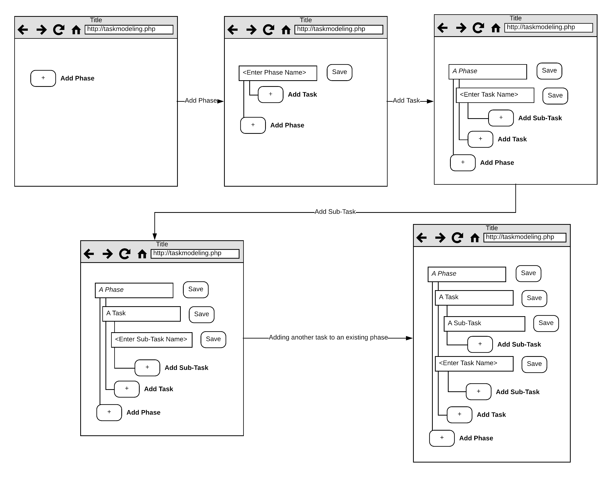

# Prototyping
This document contains a verbal and wireframe prototype for the Task Modeling Tool.

## Verbal Prototype

### Description
Conceptualize a web-interface for adding tasks to a task list.  Task building occurs in an iterative fashion for the three levels in the task hierarchy, Phase, Task, and Sub-Task.

A button named 'Add Phase' is presented on the screen to prompt the user to add a new Phase.  After they add that phase, the button 'Add Task' is also presented to notify them that they can add a Task under the Phase.

A button named 'Add Sub-Task' also appears after a task has been added to indicate that the user may add a Sub-Task under the Task.

Once any of the 'Add Phase', 'Add Task', or 'Add Sub-Task' buttons are clicked, the user will be able to enter a title and description of the task and save it.

Once any Sub-Tasks have been entered, the user may navigate to the Question modeling portion of the tool and associate a Sub-Task with a question by selecting it from a drop-down menu.

### Anticipated Questions:

**Q - Can a user reorder Phases, Tasks, or Sub-Tasks later?**

A - Yes, the user can specify an ordering at each level of the hierarchy.

**Q - Can the user input more Phases, Tasks, or Sub-Tasks in more than one session?**

A - Yes, the interface supports iterative building, they could input Tasks and then come back later and add more if needed.

**Q - Can users edit a task after it has been saved?**

A - Yes

## Wireframe

The suggested design consists of a web-page interface solely focused on adding tasks in a hierarchical, iterative way.  The user is prompted to enter Phases, Tasks, and Sub-Tasks in the order of their choosing. As the user adds Phases, Tasks, and Sub-Tasks, more prompts appear within the context of the hierarchy to indicate that another item may be entered.  Indentation of items provides a way for the user to evaluate what level of the hierarchy they are currently editing.

**Addressing the Inventory**
The interface will include an affordance for evaluating what level of the hierarchy they are editing for ease of navigation.  Also, since task modelling can be a collaborative effort, tasks may be edited, renamed, and re-ordered after creation. Please refer to the data inventory for more details.