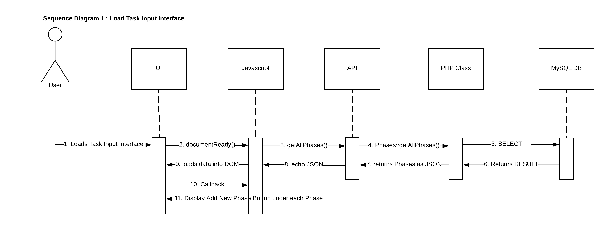
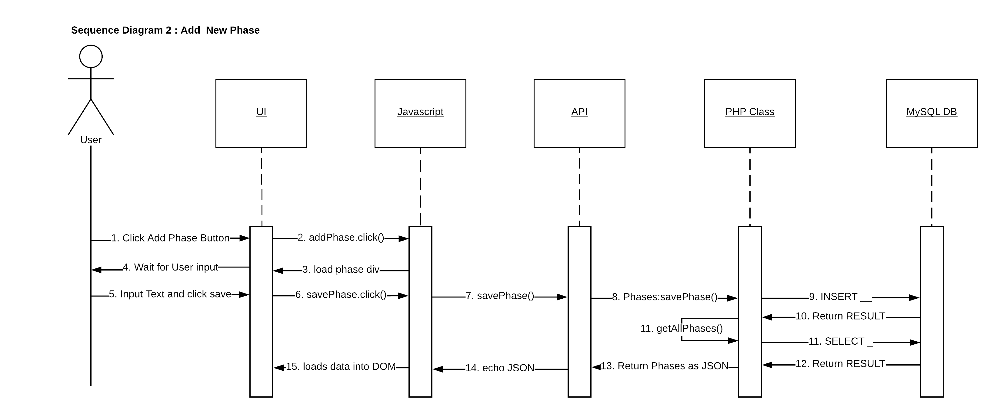
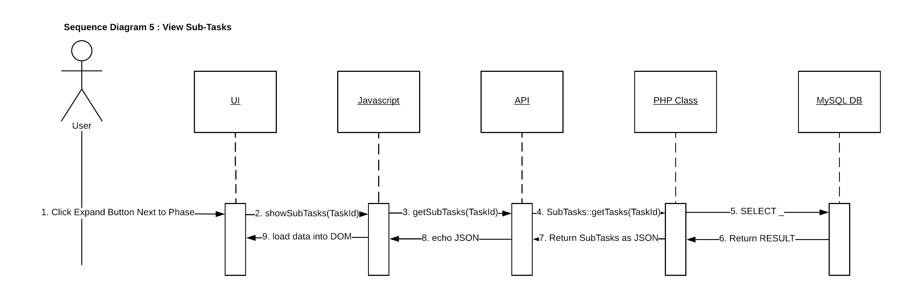

# Sequence Diagrams

<!-- *This is the template for your use case model. The parts in italics are concise explanations of what should go in the corresponding sections and should not appear in the final document.* -->

**Author**: Matthew Hull

## Sequence Diagram 1 - Load Task Input Interface

## Sequence Diagram 2 - Add New Phase

## Sequence Diagram 3 - View Tasks

## Sequence Diagram 4 - Add New Task

## Sequence Diagram 5 - View Sub-Tasks

## Sequence Diagram 6 - Add New Sub-Task

