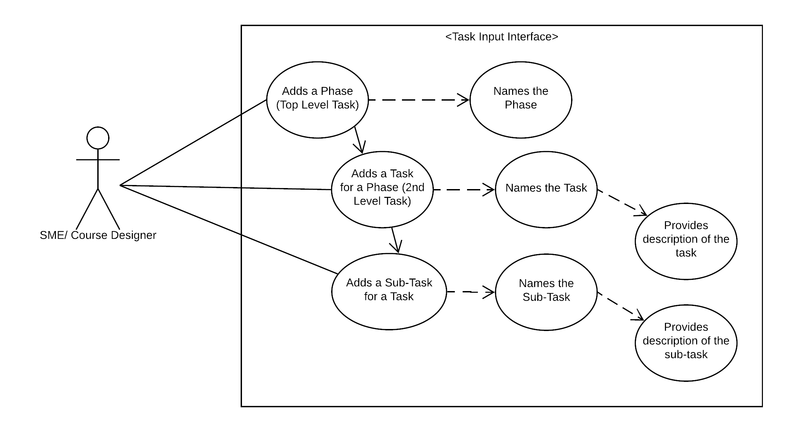
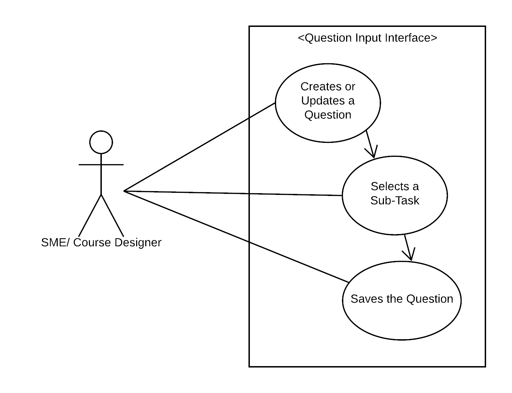

# Use Case Model

<!-- *This is the template for your use case model. The parts in italics are concise explanations of what should go in the corresponding sections and should not appear in the final document.* -->

**Author**: Matthew Hull

## 1 Use Case Diagram

<!-- *This section should contain a use case diagram with all the actors and use cases for the system, suitably connected.* -->

## 2 Use Case Descriptions

<!--
*For each use case in the use case diagram, this section should contain a description, with the following elements:*

- *Requirements: High-level description of what the use case must allow the user to do.*
- *Pre-conditions: Conditions that must be true before the use case is run.*
- *Post-conditions Conditions that must be true once the use case is run.*
- *Scenarios: Sequence of events that characterize the use case. This part may include multiple scenarios, for normal, alternate, and exceptional event sequences. These scenarios may be expressed as a list of steps in natural language or as sequence diagrams.*
-->

#### Adds a Phase (Top Level Task)
- Requirements: The user shall be able to add a phase and save it to the database.
- Pre-conditions: None.
- Post-conditions: The phase is viewable within the system.
- Scenarios:
	* Normal: The user selects to add a phase and then enters the phase title and saves it.
	* Alternate: The user adds a phase after an existing phase has been saved.
	* Exceptional: None

#### Adds a Task for a Phase (2nd Level Task)
- Requirements: The user shall be able to add a Task and save it to the database.
- Pre-conditions: Tasks may only be added to existing Phases. The user must select a Phase under which to add the Task.
- Post-conditions: The Task is viewable within the system for the Phase that it is associated with.
- Scenarios:
	* Normal: The user selects to add a Task and then enters the Task Title and saves it.
	* Alternate: The user adds a Task after an existing Task has been saved.
	* Exceptional: None

#### Adds a Sub-Task for a Task
* Requirements: The user shall be able to add a Sub-Task and save it to the database.
* Pre-conditions: Sub-Tasks may only be added to existing Tasks.  The user must select a Task under which to add the Sub-Task.
* Post-conditions: The Sub-Task is viewable within the system for the Task that it is associated with.
* Scenarios:
	* Normal: The user selects to add a Sub-Task and then enters the Sub-Task Title and saves it.
	* Alternate: The user adds a Sub-Task after an existing Sub-Task has been saved.
	* Exceptional: None

#### Provides Description of a Task
* Requirements: The user shall be able to provide a description of a Task.
* Pre-conditions: The user either added a new, un-saved Task or is editing an existing Task.
* Post-conditions: The description is viewable within the system for the Task that it is associated with. The description may be edited and re-saved.
* Scenarios:
	* Normal: The user selects the description field and enters a textual description of the Task and saves it.
	* Alternate: The user edits an existing description of a Task and saves it, over-writing the previous description.
	* Exceptional: None.

#### Provides Description of a Sub-Task
* Requirements: The user shall be able to provide a description of a Sub-Task.
* Pre-conditions: The user either added a new, un-saved Sub-Task or is editing an existing Task.
* Post-conditions: The description is viewable within the system for the Sub-Task that it is associated with. The description may be edited and re-saved.
* Scenarios:
	* Normal: The user selects the description field and enters a textual description of the Sub-Task and saves it.
	* Alternate: The user edits an existing description of a Sub-Task and saves it, over-writing the previous description.
	* Exceptional: None.

##### Notes:
The use cases for Creates or Updates a Question, Selects a Sub-Task, and Saves the Question are already existing functions within the system.  They are provided to demonstrate how the new functionality will integrate with the system, *i.e.*, how the user will be able to select a Task created in the Task Input Interface and associate it with a test question.

<!--
#### Use Case Title
* Requirements:
* Pre-conditions:
* Post-conditions:
* Scenarios:
	* Normal:
	* Alternate:
	* Exceptional:
-->
